# We Own AI Architecture Diagrams

This directory contains comprehensive architecture diagrams for the We Own AI platform, illustrating our current self-hosted, single-tenant Kubernetes deployment model and future roadmap.

## How to View

**GitHub Native**: The `.mmd` files render automatically in GitHub's web interface with full Mermaid support.

**Local Viewing**: Use any Mermaid-compatible viewer:
- [Mermaid Live Editor](https://mermaid.live/) - Copy/paste diagram content
- VS Code with Mermaid Preview extension
- [Typora](https://typora.io/) with Mermaid support
- [Draw.io](https://app.diagrams.net/) with Mermaid plugin

## Architecture Files

- `weown-ai-architecture.mmd` - Complete We Own AI platform architecture showing current deployments, planned integrations, and multi-tenant structure

## Glossary

**AnythingLLM** - Privacy-first AI assistant platform with RAG, MCP integration, and developer API. Connects to external LLM providers via API for inference.

**WordPress + Fluent Suite** - Enterprise content management with integrated CRM (FluentCRM), forms (Fluent Forms), automation (Fluent Boards), analytics (Matomo/GTmetrix), and performance optimization (Perfmatters).

**n8n** - Open-source workflow automation platform for connecting services and orchestrating agentic operations. Few workflows exist today; co-built with cohorts based on specific requests.

**Vaultwarden** - Self-hosted, Bitwarden-compatible password manager providing secrets management for all applications and automation workflows.

**kagent.dev** *(Planned)* - Kubernetes-native internal agent operations system providing job runners, schedulers, and automated cluster management tasks.

**ElizaOS** *(Planned)* - Operating system for distributed agent orchestration, enabling user-facing agents with Web3/blockchain integrations and advanced workflow capabilities.

**0.email** *(Planned)* - Agentic email processing system for automated communications, email parsing, and intelligent email workflow automation.

**Nextcloud** *(Planned)* - Self-hosted file storage and collaboration platform serving as a Google Drive alternative with enterprise security and privacy controls.

**We Own AI Lite** - Simplified SKU containing only AnythingLLM deployment for cohort members requiring basic AI assistance without full automation stack.

**We Own Cloud** *(Future Option)* - Company-owned infrastructure replacement for DigitalOcean Kubernetes, providing better scale and cost control for large-scale deployments.

## Architecture Principles

- **Single-Tenant Isolation**: Each brand, cohort program, and cohort member receives dedicated Kubernetes environment
- **Security-First**: Zero-trust networking, Pod Security Standards (Restricted), TLS 1.3, enterprise compliance (SOC2/ISO42001)
- **Self-Hosted Privacy**: All critical infrastructure runs on WeOwn-controlled infrastructure with no external SaaS dependencies
- **Helm-Based Deployment**: One chart per application with tenant-specific values enabling one-click replication
- **API-Based LLM Integration**: External LLM provider APIs (OpenAI, Anthropic) rather than local model inference
- **Progressive Enhancement**: Start with minimal configurations, co-build advanced workflows with cohort requests

```mermaid
flowchart TD
    %% Class definitions for status indication
    classDef current fill:#e6f3ff,stroke:#0066cc,stroke-width:2px;
    classDef progress fill:#f0fff0,stroke:#228b22,stroke-width:2px;
    classDef planned fill:#fff,stroke:#666,stroke-dasharray:5 4,stroke-width:1.5px;
    classDef paused fill:#fff5f5,stroke:#ff6b6b,stroke-dasharray:2 3,stroke-width:1px,font-style:italic;
    classDef lite fill:#fffbf0,stroke:#ff8c00,stroke-width:2px;

    %% External Users and Services
    Users[👥 Users / Admins]
    ExternalLLMs[🤖 External LLM Providers<br/>OpenAI, Anthropic, etc.<br/><i>API-based</i>]
    Web3Services[⛓️ Web3 Services<br/>Unlock Protocol, Splits.org<br/>HATS, Snapshot]

    %% Current Platform
    subgraph Platform[🌊 Current Platform: DigitalOcean Kubernetes]
        direction TB
        
        %% Shared Infrastructure
        subgraph SharedInfra[🛠️ Shared Infrastructure per Cluster]
            direction LR
            NGINXIngress[NGINX Ingress Controller<br/>LoadBalancer + TLS 1.3]
            CertManager[cert-manager<br/>Let's Encrypt Automation]
            Monitoring[Metrics Server + Portainer<br/>Resource Monitoring]
        end

        %% Tenant Examples
        subgraph Tenants[🏢 Tenant Clusters - Isolated K8s Environments]
            direction TB
            
            %% Internal Brand Cluster
            subgraph Brand[🎯 Internal Brand Cluster<br/><i>Full We Own AI Stack</i>]
                direction TB
                A1[AnythingLLM<br/><i>Helm chart</i>]:::current
                W1[WordPress + Fluent Suite<br/><i>Helm chart</i>]:::current
                N1[n8n Workflows<br/><i>Helm chart</i>]:::progress
                V1[Vaultwarden Secrets<br/><i>Helm chart</i>]:::current
                
                %% Planned apps for brand
                K1[kagent.dev<br/><i>K8s Agent Operations</i>]:::planned
                E1[ElizaOS<br/><i>User-facing Agents</i>]:::planned
                O1[0.email<br/><i>Agentic Email</i>]:::planned
                X1[Nextcloud<br/><i>File Storage</i>]:::planned
            end

            %% Cohort Program Cluster
            subgraph Cohort[🎓 Cohort Program Cluster<br/><i>Standard Configuration</i>]
                direction TB
                A2[AnythingLLM<br/><i>Helm chart</i>]:::current
                W2[WordPress + Fluent Suite<br/><i>Helm chart</i>]:::current
                N2[n8n Workflows<br/><i>Helm chart</i>]:::progress
                V2[Vaultwarden Secrets<br/><i>Helm chart</i>]:::current
            end

            %% Member Cluster (Lite)
            subgraph Member[👤 Cohort Member Cluster<br/><i>We Own AI Lite</i>]
                direction TB
                A3[AnythingLLM Only<br/><i>Helm chart</i>]:::lite
                LiteNote[💡 We Own AI Lite SKU<br/>AnythingLLM only deployment]:::lite
            end
        end
    end

    %% Future Platform Option
    subgraph Future[🚀 Future Option: We Own Cloud]
        direction TB
        CloudReplacement[🏭 Company-Owned Infrastructure<br/>Drop-in replacement for DO K8s<br/>Better scale + cost control]:::planned
    end

    %% App Capabilities - AnythingLLM
    A1 --> A1RAG[📚 RAG Document Processing]
    A1 --> A1MCP[🔌 MCP Protocol Integration]
    A1 --> A1Agents[🤖 Agent Tooling + Linking]
    A1 --> A1API[🔧 Developer API Access]
    A1 --> A1Workspaces[🏗️ Dedicated Workspaces<br/>User Access + Model Settings]

    %% App Capabilities - WordPress + Fluent Suite
    W1 --> W1Forms[📝 Fluent Suite<br/>Forms, CRM, Automations]
    W1 --> W1Analytics[📊 Analytics<br/>Matomo + GTmetrix]
    W1 --> W1Performance[⚡ Performance<br/>Perfmatters + Caching]
    W1 --> W1Sites[🌐 Custom Site Builder]

    %% App Capabilities - n8n
    N1 --> N1Connections[🔗 Workflow Automations<br/><i>Few built today, co-build with cohorts</i>]

    %% App Capabilities - Vaultwarden
    V1 --> V1Secrets[🔐 Password Management<br/>Secrets for Apps + Automations]

    %% Planned App Capabilities
    K1 --> K1Jobs[⚙️ K8s Job Runners + Schedulers<br/>Internal Agent Operations]
    E1 --> E1UserAgents[👨‍💼 User-facing Agents<br/>Workflow + Web3 Integration]
    O1 --> O1Email[📧 Agentic Email Processing<br/>Automated Communications]
    X1 --> X1Storage[💾 Self-hosted File Storage<br/>Google Drive Alternative]

    %% Data Flow and Interactions
    Users --> W1
    Users --> W2
    Users --> A3

    %% WordPress triggers n8n workflows
    W1 --> N1
    W2 --> N2

    %% n8n orchestrates with AnythingLLM
    N1 <--> A1
    N2 <--> A2

    %% AnythingLLM connects to external LLM providers
    A1 <--> ExternalLLMs
    A2 <--> ExternalLLMs
    A3 <--> ExternalLLMs

    %% Vaultwarden supplies secrets to all apps
    V1 -.-> W1
    V1 -.-> N1
    V1 -.-> A1
    V1 -.-> K1
    V1 -.-> E1

    V2 -.-> W2
    V2 -.-> N2
    V2 -.-> A2

    %% Planned integrations
    W1 <--> X1
    N1 <--> O1
    N1 <--> K1
    E1 <--> W1
    E1 <--> Web3Services

    %% Shared infrastructure connections
    NGINXIngress -.-> Brand
    NGINXIngress -.-> Cohort
    NGINXIngress -.-> Member
    CertManager -.-> Brand
    CertManager -.-> Cohort
    CertManager -.-> Member

    %% Paused/Backlog item
    LLMDPaused[LLM-D Local Inference<br/><i>Paused: Resource Constraints</i>]:::paused

    %% Legend
    subgraph Legend[📋 Status Legend]
        direction LR
        LegendCurrent[■ Current: Production Ready]:::current
        LegendProgress[■ In Progress: Active Development]:::progress
        LegendPlanned[■ Planned: Roadmap Items]:::planned
        LegendPaused[■ Paused: Resource Limited]:::paused
        LegendLite[■ We Own AI Lite SKU]:::lite
    end

    %% Deployment Notes
    subgraph DeploymentNotes[📝 Deployment Architecture]
        direction TB
        Note1[🎯 One Helm chart per app + tenant-specific values]
        Note2[🔄 Repeatable one-click replication across tenants]
        Note3[🏗️ Minimal WordPress/Fluent/n8n workflows exist today]
        Note4[👥 Co-build with cohorts based on requests]
        Note5[🔒 Each tenant = isolated K8s environment]
        Note6[🌊 Single-tenant deployments on DigitalOcean K8s]
    end

    %% Comments and annotations
    %% CURRENT: AnythingLLM, WordPress+Fluent, Vaultwarden - all production ready with enterprise security
    %% IN-PROGRESS: n8n deployment system complete, few workflows built yet
    %% PLANNED: kagent.dev (K8s-native agents), ElizaOS (user agents), 0.email, Nextcloud
    %% PAUSED: LLM-D due to resource constraints on base-size DO clusters
    %% LITE SKU: We Own AI Lite = AnythingLLM only deployment
    %% FUTURE: We Own Cloud as drop-in replacement for DigitalOcean infrastructure
```

