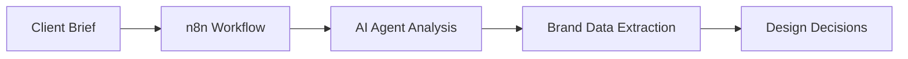

# WeOwn WordPress Development Framework

> **Enterprise-grade, modular WordPress theme and deployment system designed for multi-tenant cohort distribution with AI-powered customization capabilities.**

## 🎯 **Overview**

The WeOwn WordPress Development Framework is a professional, scalable system for building and deploying customized WordPress sites across multiple brands, cohorts, and clients. Built with security-first principles, enterprise compliance, and AI integration readiness.

### **Key Features**

- ✅ **Kadence Child Theme Foundation** - Professional parent theme with extensive customization
- ✅ **Modular Plugin Architecture** - Feature-based plugins for maximum flexibility
- ✅ **Site Overlay System** - Brand-specific configurations without code duplication
- ✅ **Enterprise Security Standards** - Zero-trust, SOC2/ISO42001 compliance ready
- ✅ **AI Integration Ready** - API endpoints and automation framework prepared
- ✅ **Multi-Tenant Deployment** - Infinite scalability for cohort distribution
- ✅ **Non-Technical User Interface** - WordPress Customizer integration for easy branding

## 📊 **Development Status**

### **Current Phase: Phase 1 Complete ✅**
**Core Theme Foundation** - Successfully implemented enterprise-grade WordPress theme with:
- Essential WordPress theme files (index.php, header.php, footer.php, page.php, front-page.php)
- Dynamic branding system with site configuration parsing and CSS custom properties
- Template parts architecture (navigation.php, hero-section.php, call-to-action.php)
- Comprehensive functions.php with enterprise-grade theme functionality
- Responsive CSS with dynamic brand color integration and accessibility features

### **Current Phase: Phase 2 Complete ✅**
**Advanced Page Templates** - Successfully implemented comprehensive business and content templates:
- Business page templates (About, Services, Contact, Portfolio) with professional layouts and conversion elements
- Blog and content templates (single.php, archive.php, category.php, search.php) with enhanced readability and engagement
- Landing page templates (Lead Gen, AI Showcase, Cohort/Webinar, SaaS Product) with advanced conversion optimization
- Template parts integration for consistent design across all page types

### **Current Phase: Phase 3.1 Complete ✅**
**WordPress Customizer Integration (Global Branding Layer)** - Enterprise-grade customizer system:
- **31 customizer controls** across 7 organized sections (Brand Colors, Typography, Logo & Branding, Layout & Spacing, Header, Footer, Performance)
- **Dynamic CSS generation** with CSS custom properties and transient caching for performance
- **Live preview system** with debounced JavaScript updates (no page reload required)
- **Google Fonts integration** with 50+ curated professional fonts and dynamic loading
- **Security-first architecture** with 12 sanitization functions and XSS prevention
- **Custom UI controls** (Range with live value display, Font selector, Info sections)
- **Automatic shade generation** for hover states (light/dark color variants)
- **Modular typography scale** system (auto-calculates h1-h6 sizes based on ratio)
- **8px base unit spacing** system for consistent rhythm
- **Phase 4 automation ready** with {{PLACEHOLDER}} support for n8n integration

### **Next Phase: Phase 3.2 🔄 (Gutenberg Blocks)**
**Focus**: Custom blocks that inherit customizer settings for consistent branding

**Phase 3.2: Custom Gutenberg Blocks (Page-Specific Content Layer)**
- WeOwn Hero Block (multiple layout variations: split, centered, full-width)
- Feature Grid Block (services, benefits, product features)
- Team/About Block (team members, company stats, testimonials)
- Call-to-Action Block (buttons, forms, conversion elements)
- Services Block (pricing tables, service cards, comparison)
- Portfolio Block (case studies, project galleries, client logos)
- Contact Block (forms, maps, contact information)
- Testimonials Block (carousel, grid, single testimonial)

**Phase 3.3: Block Patterns & Templates**
- Pre-designed page layouts (About, Services, Contact, Portfolio)
- Section pattern library (hero combinations, feature layouts)
- Template parts for reuse (headers, footers, sidebars)
- Pattern categories for organization (business, creative, technical)

**Phase 3.4: MU-Plugins Security & Performance**
- Security hardening (disable file editing, XML-RPC, version hiding)
- Performance optimization (asset minification, lazy loading, caching)
- SEO fundamentals (meta tags, structured data, sitemaps)
- Analytics integration (Google Analytics, custom tracking)

### **Next Phase: Phase 4 🚀 (AI Integration & Full Automation)**
**Focus**: Complete automation pipeline with n8n integration

**Phase 4.1: REST API Framework**
- `/wp-json/weown/v1/customize` - Bulk Customizer settings update
- `/wp-json/weown/v1/pages/create` - Dynamic page creation with blocks
- `/wp-json/weown/v1/media/upload` - Automated image/logo upload
- `/wp-json/weown/v1/analytics` - Site performance and user data
- Authentication system for n8n workflow integration

**Phase 4.2: Build System & Asset Optimization**
- Webpack configuration for CSS/JS bundling and optimization
- SASS integration with automatic CSS custom property generation
- Image optimization pipeline (WebP conversion, compression)
- Font subsetting and optimization for performance

**Phase 4.3: CI/CD Automation Pipeline**
- Automated site generation from client briefs via n8n workflows
- Container building with site-specific wp-content injection
- Multi-environment deployment (staging → production)
- Automated testing (security, performance, accessibility)
- Zero-downtime deployments with rollback capability

**Phase 4.4: Performance Monitoring & Optimization**
- Core Web Vitals tracking and automated optimization
- Error tracking and automated alerting
- Performance regression detection
- Automated backup and disaster recovery

## 📁 **Directory Structure**

```
wordpress-dev/
├── template/                    # 🎨 Master reusable template
│   └── wp-content/
│       ├── themes/weown-starter/    # Child theme (Kadence parent)
│       ├── plugins/                 # Custom feature plugins
│       └── mu-plugins/              # Mandatory security & functionality
├── sites/{site}/               # 🏢 Site-specific configurations
│   ├── site.config.yaml        # Branding & feature configuration
│   ├── overrides/              # Site-specific customizations
│   ├── values-staging.yaml     # Staging deployment config
│   └── values-prod.yaml        # Production deployment config
├── scripts/                    # 🔧 Automation & build tools
├── docs/                      # 📚 Documentation & guides
└── phpcs.xml                  # 🧹 Code quality standards
```

## 🚀 **Quick Start**

### **Prerequisites**
- PHP 8.3+
- Composer
- WordPress 6.0+
- Kadence Theme

### **1. Generate New Site**
```bash
# Create a new site configuration
./scripts/generate-site.sh my-brand

# Customize the generated configuration
vim sites/my-brand/site.config.yaml
```

### **2. Build Site Assets**
```bash
# Assemble wp-content for deployment
./scripts/assemble-wp-content.sh my-brand

# Build output will be in .build/my-brand/wp-content/
```

### **3. Deploy Site**
```bash
# Development deployment
cp -r .build/my-brand/wp-content/* /path/to/wordpress/wp-content/

# Or use container deployment (coming soon)
docker build -f Dockerfile.app --build-arg SITE=my-brand .
```

## 🎨 **Theme Customization**

### **Brand Configuration**
Edit `sites/{site}/site.config.yaml` to customize:

```yaml
site:
  key: my-brand
  name: "{{SITE_NAME}}"           # Will be replaced by deployment script
  domain: "{{SITE_DOMAIN}}"       # Will be replaced by deployment script  
  description: "{{SITE_DESCRIPTION}}"
  palette:
    primary: "{{PRIMARY_COLOR}}"   # Main brand color
    secondary: "{{SECONDARY_COLOR}}" # Secondary color
    accent: "{{ACCENT_COLOR}}"     # Accent/highlight color
  logo_svg: "./branding/my-brand-logo.svg"

features:
  landing_route: true             # Enable custom landing pages
  forms: false                   # Contact forms integration
  analytics: true                # Google Analytics support
  social_media: false           # Social media integration
```

### **Theme Overrides**
Place site-specific customizations in `sites/{site}/overrides/wp-content/`:

```
sites/my-brand/overrides/wp-content/
├── themes/weown-starter/
│   ├── templates/landing-custom.php  # Custom page template
│   └── assets/css/brand.css         # Brand-specific styles
└── plugins/my-brand-features/       # Site-specific plugins
    └── my-brand-features.php
```

## 🔧 **Development Workflow**

### **Code Quality**
```bash
# Run PHP CodeSniffer
composer global require squizlabs/php_codesniffer
phpcs --standard=phpcs.xml .

# Run WordPress coding standards
composer global require wp-coding-standards/wpcs
phpcs --standard=WordPress .
```

### **Template Development**
1. **Edit master template** in `template/wp-content/`
2. **Create site overrides** in `sites/{site}/overrides/`
3. **Build and test** with `./scripts/assemble-wp-content.sh {site}`
4. **Deploy** to development environment

### **Plugin Development**
- **Feature plugins** go in `template/wp-content/plugins/`
- **Site-specific plugins** go in `sites/{site}/overrides/wp-content/plugins/`
- **Mandatory plugins** go in `template/wp-content/mu-plugins/`

## 🛡️ **Security & Compliance**

### **Enterprise Security Features**
- ✅ **Zero-Trust Architecture** - NetworkPolicy enforcement, pod security standards
- ✅ **Input Sanitization** - All user input properly sanitized and validated
- ✅ **Output Escaping** - Context-aware output escaping throughout
- ✅ **HTTPS Enforcement** - TLS 1.3 with Let's Encrypt automation
- ✅ **Security Headers** - HSTS, CSP, X-Frame-Options, etc.
- ✅ **Capability Management** - Proper WordPress role and capability enforcement

### **Compliance Standards**
- **SOC2 Type II Ready** - Comprehensive audit controls implemented
- **ISO 42001 Ready** - AI governance and risk management framework
- **WCAG 2.1 AA** - Accessibility compliance built-in
- **GDPR Compliant** - Privacy-first data handling

## 🤖 **AI Integration**

### **Automation Framework**
- **REST API Endpoints** - Custom endpoints for theme customization
- **Webhook Integration** - External service integration capabilities  
- **Template Generation** - Automated page template creation
- **Content Management** - AI-powered content optimization

### **Customization Engine** 
- **Dynamic CSS Injection** - Real-time brand color application
- **Logo Management** - Automated logo placement and sizing
- **Typography System** - Brand-specific font loading
- **Layout Optimization** - AI-guided layout improvements

## 📚 **Documentation**

- **[Development Guide](docs/dev/custom-site-dev.md)** - Comprehensive development documentation
- **[Deployment Guide](docs/ops/wordpress-cicd.md)** - CI/CD and deployment procedures
- **[Architecture Guide](ARCHITECTURE.md)** - System architecture and design patterns

## 🔄 **CI/CD & Automation Architecture**

### **Automated Site Generation Pipeline (n8n Integration)**

**Step 1: Client Brief Processing**


**Step 2: WordPress Site Creation**
```bash
# n8n calls WordPress REST API
POST /wp-json/weown/v1/customize
{
  "primary_color": "#FF5733",
  "company_name": "Acme Corp",
  "logo_url": "https://...",
  "fonts": { "heading": "Montserrat", "body": "Open Sans" }
}

# n8n creates custom pages with blocks
POST /wp-json/weown/v1/pages/create
{
  "title": "About Us",
  "blocks": [
    { "type": "weown/hero", "attributes": {...} },
    { "type": "weown/team", "attributes": {...} }
  ]
}
```

**Step 3: Containerized Deployment**
```yaml
# GitHub Actions Workflow
name: Deploy Client Site
on:
  workflow_dispatch:
    inputs:
      client_name: { required: true }
      domain: { required: true }
      
njobs:
  deploy:
    steps:
    - name: Generate Site Content
      run: ./scripts/assemble-wp-content.sh ${{ inputs.client_name }}
    
    - name: Build Container
      run: |
        docker build -f Dockerfile.app \
          --build-arg SITE=${{ inputs.client_name }} \
          -t ghcr.io/weown/wordpress:${{ inputs.client_name }} .
    
    - name: Deploy to Kubernetes
      run: |
        helm upgrade --install ${{ inputs.client_name }} ./helm \
          --set site.domain=${{ inputs.domain }} \
          --set image.tag=${{ inputs.client_name }} \
          --namespace wordpress-${{ inputs.client_name }}
```

### **Production Deployment Architecture**

**Kubernetes Integration**
```yaml
# Helm Chart Values (per client)
site:
  name: "${CLIENT_NAME}"
  domain: "${CLIENT_DOMAIN}"
  
image:
  repository: ghcr.io/weown/wordpress
  tag: "${CLIENT_NAME}"  # Site-specific container
  
wordpress:
  persistence:
    content: 8Gi   # wp-content PVC
    core: 4Gi     # WordPress core files
    config: 1Gi   # wp-config and settings
    cache: 1Gi    # Performance caching
  
backup:
  schedule: "0 2 * * *"  # Daily 2 AM
  retention: "30d"
  storage: 20Gi

networkPolicy:
  enabled: true  # Zero-trust networking
  
security:
  podSecurityStandards: "restricted"
  enforceHTTPS: true
  rateLimiting:
    requests: 100  # per minute
    connections: 20
```

**Automated Testing Pipeline**
```bash
# Quality Gates (runs on every deployment)
./scripts/test-security.sh $CLIENT_NAME     # Security vulnerability scan
./scripts/test-performance.sh $CLIENT_NAME  # Core Web Vitals validation  
./scripts/test-accessibility.sh $CLIENT_NAME # WCAG 2.1 AA compliance
./scripts/test-seo.sh $CLIENT_NAME          # SEO best practices
```

### **Enterprise CI/CD Features**

**Multi-Environment Strategy**
- **Development**: Local Docker containers for rapid iteration
- **Staging**: Kubernetes staging namespace with production parity
- **Production**: Blue-green deployment with zero downtime
- **Rollback**: Automated rollback on health check failures

**Security Integration**
- **Container Scanning**: Vulnerability detection in base images
- **Secret Management**: Kubernetes secrets with rotation
- **Network Policies**: Zero-trust micro-segmentation
- **Compliance**: SOC2/ISO42001 audit trail maintenance

**Performance Optimization**
- **Asset Pipeline**: Webpack bundling with cache optimization
- **Image Processing**: WebP conversion and compression
- **CDN Integration**: Automatic asset distribution
- **Cache Warming**: Pre-populate caches post-deployment

## 🏢 **WeOwn Cloud Integration**

### **Multi-Tenant Architecture**
- **Cohort Isolation** - Separate configurations per cohort/brand
- **Resource Optimization** - Shared templates, isolated customizations
- **Scalability** - Unlimited site generation from single codebase
- **Cost Efficiency** - Minimal resource overhead per site

### **Enterprise Features**
- **Team Collaboration** - Multi-developer workflow support
- **Version Control** - Git-based configuration management
- **Audit Logging** - Complete change tracking and accountability
- **Backup Integration** - Automated backup and restore capabilities

## 📈 **Performance Optimization**

### **Built-in Optimizations**
- **Conditional Asset Loading** - Only load required CSS/JS per page
- **Image Optimization** - Automated WebP conversion and lazy loading
- **Caching Strategy** - Multi-layer caching implementation
- **CDN Ready** - Optimized for content delivery networks

### **Monitoring Integration**
- **Performance Metrics** - Core Web Vitals tracking
- **Error Tracking** - Automated error detection and reporting
- **Analytics Integration** - Google Analytics and custom metrics
- **Uptime Monitoring** - Site availability and response time tracking

## 🤝 **Contributing**

### **Development Standards**
1. Follow WordPress coding standards
2. Use semantic commit messages
3. Write comprehensive tests
4. Document all functions and classes
5. Maintain security-first approach

### **Pull Request Process**
1. Fork and create feature branch
2. Make changes following coding standards
3. Run all quality checks locally
4. Submit PR with detailed description
5. Address review feedback promptly

## 📝 **License**

This project is proprietary software developed by WeOwn. All rights reserved.

## 🆘 **Support**

- **Documentation**: Check `/docs` directory for comprehensive guides
- **Issues**: Report bugs and feature requests via GitHub Issues
- **Enterprise Support**: Contact WeOwn team for enterprise assistance
- **Community**: Join WeOwn Academy for community support

---

**Version**: 1.0.0  
**Last Updated**: 2025-10-07  
**Maintainer**: WeOwn Development Team
